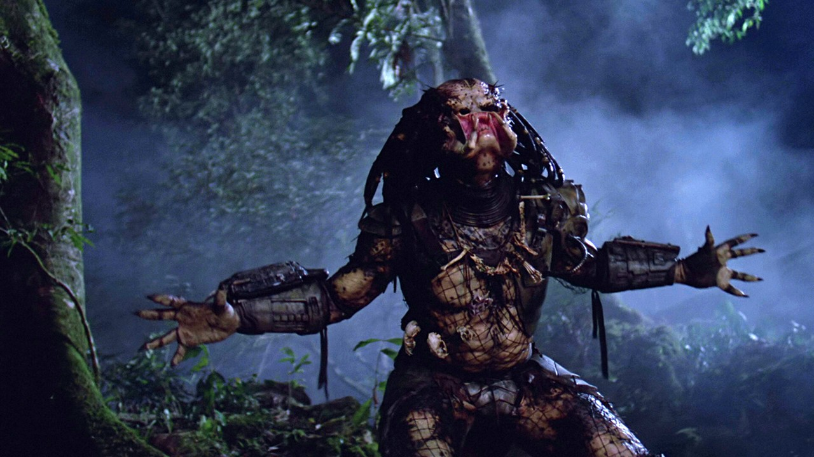

# Git. Что ты такое?

**Git** — один из видов систем контроля версий (или СКВ).
Такие системы записывают изменения в набор файлов, а позже позволяют вернуться к определенной версии.
Вы сможете вернуться к любому из сохраненных состояний, просмотреть изменения и увидеть их авторов.
Cистему контроля версий в Git проще всего представлять как *поток снимков* (сохраненных состояний проекта).

Чаще всего работа с Git устроена примерно так:

1. Вы вносите правки в файлы рабочей копии проекта.

2. Индексируете их, подготавливая к коммиту (здесь Git создает снимки новых правок).

3. Делаете коммит, и индексированные правки наконец сохраняются в вашем каталоге Git.

[<< Вернуться к содержанию](../../readme.md)
